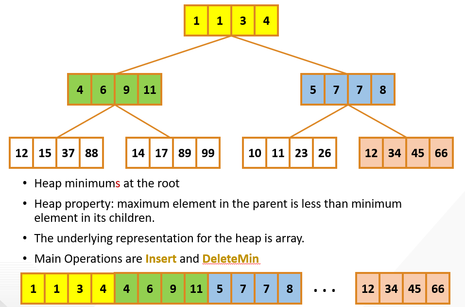

# GPU-Accelerated Heap

This project presents an efficient implementation of a binary heap data structure optimized for GPU architectures. The heap is organized as a contiguous array and supports batch operations for insertions and deletions.

## Description

The data structure used in this project is a binary heap, which maintains the heap property in batches. Each batch consists of arrays of size `batch_size`. The heap itself is implemented in a single contiguous array to optimize memory access patterns on the GPU. The primary operations supported by this heap are batched inserts and batched deletions of the minimum element (`deleteMin`).

### Key Optimizations

1. **Thread Coarsening:** This technique increases the workload per thread, thereby reducing the overhead of thread management and improving the efficiency of each warp in the GPU.
2. **Pipelining:** Utilizes multiple stages of computation simultaneously to maximize throughput and minimize latency across operations.
3. **Shared Memory Utilization:** Leverages fast shared memory on the GPU to speed up frequent data access and reduce global memory latency.
4. **Compiler Optimization Enhancements:** Includes loop unrolling and other compiler-based optimizations to enhance performance further.

## Usage

To compile and run the GPU-accelerated heap implementation, follow these steps:

1. Compile the project by running: **make**
2. Execute the binary with the required parameters: **./heap <block_size> <batch_size> <test_array_size>**
- `block_size`: The size of each block in the GPU.
- `batch_size`: The size of each batch for operations.
- `test_array_size`: The total size of the array to be tested.

### Example

To run the heap with a block size of 512, a batch size of 2048, and a test array size of 10,000,000, use:
**./heap 512 2048 10000000**

## Visual Representation of Heap Structure

